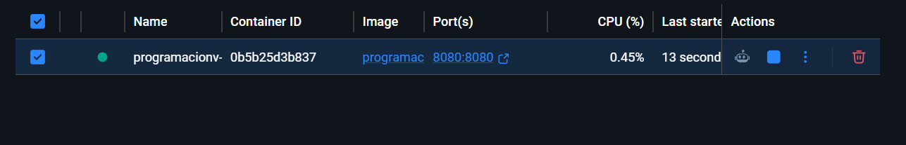
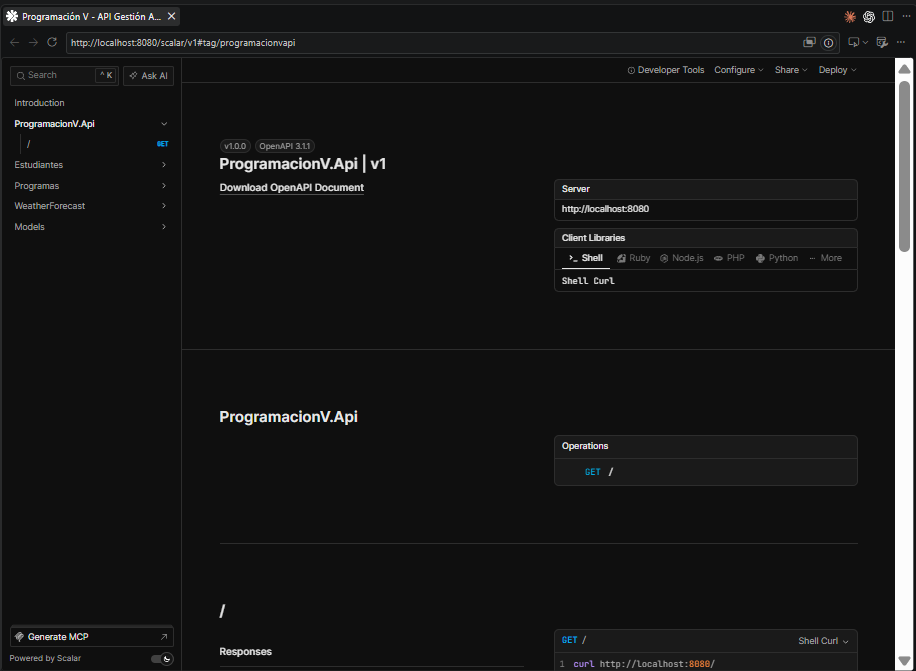
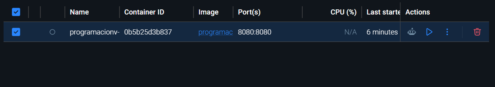
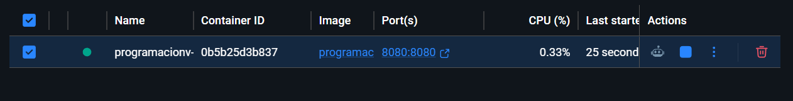
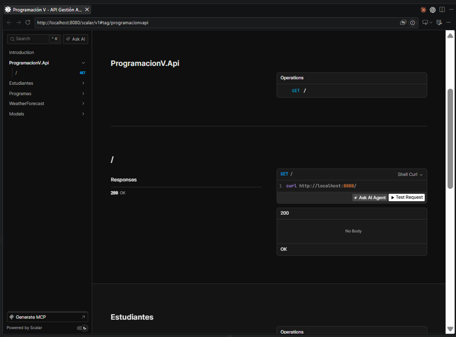
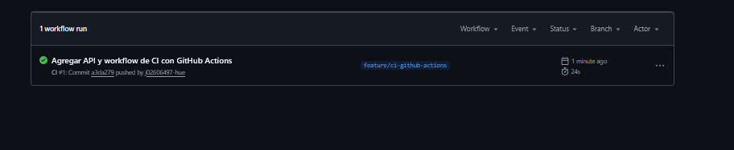
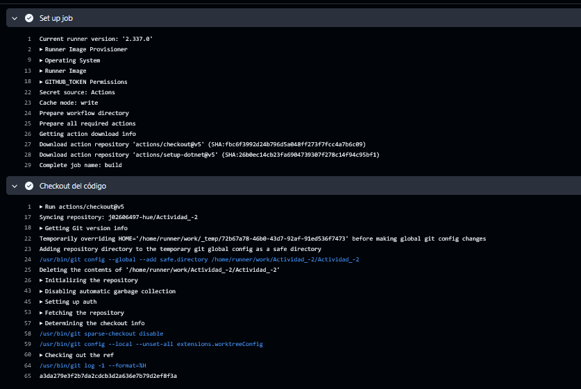
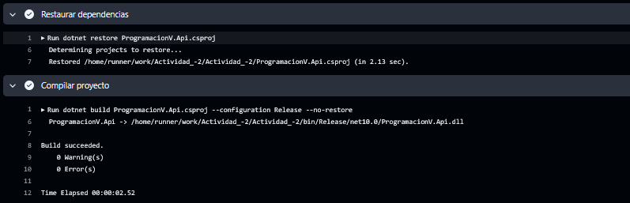
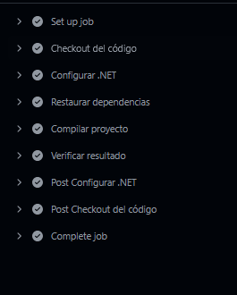

# Actividad individual N°2 Desafío DevOps: de la API al despliegue


---


### Estudiante

Juan Jose Pareja Ruiz


### Universidad

Universidad de Manizales  


### Facultad

Facultad de Ciencias e Ingeniería


### Programa Academico

Programa de Ingeniería de Sistemas Virtual


### Curso

Programacion V 


### Profesor

Carlos Alberto Gutierrez Rodas


---


# Desafio 1. Contenerización de la API

## Contenido del Dockerfile

```bash


FROM mcr.microsoft.com/dotnet/sdk:10.0 AS build
WORKDIR /src

COPY ["ProgramacionV.Api.csproj", "./"]
RUN dotnet restore "ProgramacionV.Api.csproj"

COPY . .
RUN dotnet publish "ProgramacionV.Api.csproj" -c Release -o /app/publish /p:UseAppHost=false

FROM mcr.microsoft.com/dotnet/aspnet:10.0 AS final
WORKDIR /app

EXPOSE 8080
ENV ASPNETCORE_URLS=http://+:8080

COPY --from=build /app/publish .
ENTRYPOINT ["dotnet", "ProgramacionV.Api.dll"]


```


## Comandos utilizados

## Carpeta del proyecto

```bash
 
- Comando: PS C:\Users\juanj\OneDrive\Desktop\programacion5_Actividad2 - copia - copia - copia - copia - copia - copia\ProgramacionV>  cd ProgramacionV.Api

- Resultado: El directorio actual cambia a la carpeta ProgramacionV.Api.

- Respuesta: Se accedió correctamente a la carpeta del proyecto donde se encuentra la API.

```

## Construcción de la imagen

```bash

- Comando: PS C:\Users\juanj\OneDrive\Desktop\programacion5_Actividad2 - copia - copia - copia - copia - copia - copia\ProgramacionV\ProgramacionV.Api> docker build -t programacionv-api:latest .

- Resultado: 

[+] Building 8.9s (15/15) FINISHED                                                                                                                           docker:desktop-linux
 => [internal] load build definition from Dockerfile                                                                                                                         0.0s
 => => transferring dockerfile: 502B                                                                                                                                         0.0s
 => [internal] load metadata for mcr.microsoft.com/dotnet/aspnet:10.0                                                                                                        0.9s
 => [internal] load metadata for mcr.microsoft.com/dotnet/sdk:10.0                                                                                                           0.9s
 => [internal] load .dockerignore                                                                                                                                            0.0s
 => => transferring context: 90B                                                                                                                                             0.0s
 => [final 1/3] FROM mcr.microsoft.com/dotnet/aspnet:10.0@sha256:6a94333d37514e385650a3c81a55e5350b67253dbe136e9cf17e499c35606a8c                                            0.0s
 => => resolve mcr.microsoft.com/dotnet/aspnet:10.0@sha256:6a94333d37514e385650a3c81a55e5350b67253dbe136e9cf17e499c35606a8c                                                  0.0s
 => [build 1/6] FROM mcr.microsoft.com/dotnet/sdk:10.0@sha256:2fa828c68761b1b8c23d7662dc134421b9d3b59fe1425fdbc80804e390cdb24d                                               0.0s
 => => resolve mcr.microsoft.com/dotnet/sdk:10.0@sha256:2fa828c68761b1b8c23d7662dc134421b9d3b59fe1425fdbc80804e390cdb24d                                                     0.0s
 => [internal] load build context                                                                                                                                            0.1s
 => => transferring context: 61.36kB                                                                                                                                         0.0s
 => CACHED [build 2/6] WORKDIR /src                                                                                                                                          0.0s
 => CACHED [build 3/6] COPY [ProgramacionV.Api.csproj, ./]                                                                                                                   0.0s
 => CACHED [build 4/6] RUN dotnet restore "ProgramacionV.Api.csproj"                                                                                                         0.0s
 => [build 5/6] COPY . .                                                                                                                                                     0.1s
 => [build 6/6] RUN dotnet publish "ProgramacionV.Api.csproj" -c Release -o /app/publish /p:UseAppHost=false                                                                 7.4s
 => CACHED [final 2/3] WORKDIR /app                                                                                                                                          0.0s
 => CACHED [final 3/3] COPY --from=build /app/publish .                                                                                                                      0.0s
 => exporting to image                                                                                                                                                       0.1s
 => => exporting layers                                                                                                                                                      0.0s
 => => exporting manifest sha256:fb1f743391699f13444649e51b7b0650f92609f71fbd0ff660694a478c6c62a2                                                                            0.0s
 => => exporting config sha256:31277c9368337d5753e64c104fa45804a9430686622dcb5293829e9162f65d29                                                                              0.0s
 => => exporting attestation manifest sha256:6faf9ce9055e3ffbecf8ba36e35c9c22a367e12e2cd47d3e1053cb00492be6e9                                                                0.0s
 => => exporting manifest list sha256:158b2b5fc8553c8f2d08b7eecb25178825ef734f0fa6116f2f03e3478588f4d8                                                                       0.0s
 => => naming to docker.io/library/programacionv-api:latest                                                                                                                  0.0s
 => => unpacking to docker.io/library/programacionv-api:latest                                                                                                               0.0s

- Respuesta: La imagen Docker de la API se construyó correctamente a partir del Dockerfile.

```


## Evidencia de la imagen creada

```bash

- Comando: PS C:\Users\juanj\OneDrive\Desktop\programacion5_Actividad2 - copia - copia - copia - copia - copia - copia\ProgramacionV\ProgramacionV.Api> docker images

- Resultado: 
                                                      
IMAGE                      ID             DISK USAGE   CONTENT SIZE   EXTRA
programacionv-api:latest   158b2b5fc855        403MB          117MB        

- Respuesta: Se confirma que la imagen Docker de la API fue creada correctamente y está disponible localmente para ejecutar un contenedor.

```


## Crear el contenedor

```bash

- Comando: PS C:\Users\juanj\OneDrive\Desktop\programacion5_Actividad2 - copia - copia - copia - copia - copia - copia\ProgramacionV\ProgramacionV.Api>  docker run -d --name programacionv-api-container -p 8080:8080 programacionv-api:latest

- Resultado: 0b5b25d3b83708e1166112662646f6e799fb5f1b6638749071f6414f6cac7c8e

- Respuesta: El contenedor fue creado y puesto en ejecución correctamente, utilizando el puerto 8080 del contenedor y asociándolo al puerto 8080 del equipo.

```


## Evidencia del contenedor en ejecución



```bash

- Comando: PS C:\Users\juanj\OneDrive\Desktop\programacion5_Actividad2 - copia - copia - copia - copia - copia - copia\ProgramacionV\ProgramacionV.Api> docker ps

- Resultado: 

CONTAINER ID   IMAGE                      COMMAND                  CREATED              STATUS              PORTS                                         NAMES
0b5b25d3b837   programacionv-api:latest   "dotnet Programacion…"   About a minute ago   Up About a minute   0.0.0.0:8080->8080/tcp, [::]:8080->8080/tcp   programacionv-api-container

- Respuesta: Se confirma que el contenedor está ejecutándose correctamente y que la API está disponible mediante el puerto 8080.

```


## Evidencia de la API funcionando desde el contenedor



Al abrir en el navegador:

```bash

http://localhost:8080/

```


La API redirige automáticamente a la documentación Scalar:

```bash

http://localhost:8080/scalar/v1

```


## Puerto utilizado

- Puerto: 8080

- Respuesta: La aplicación utiliza el puerto 8080, configurado en el Dockerfile.


## Preguntas

## ¿Cuál es la diferencia entre una imagen Docker y un contenedor?

- Respuesta: 

La imagen Docker contiene la aplicación y todo lo necesario para ejecutarla. El contenedor es una instancia en ejecución de esa imagen.

## ¿Por qué la aplicación puede ejecutarse en un contenedor aunque el usuario no ejecute directamente dotnet run?

- Respuesta:

Porque Docker ejecuta automáticamente el ENTRYPOINT definido en la imagen. En este caso, el contenedor inicia directamente ProgramacionV.Api.dll mediante dotnet, por lo que no es necesario ejecutar manualmente dotnet run.


---


# Desafio 2. Administración del contenedor

## Comandos utilizados

## Nombre e identificador del contenedor su Imagen utilizada y el estado inicial

```bash

- Comando: PS C:\Users\juanj\OneDrive\Desktop\programacion5_Actividad2 - copia - copia - copia - copia - copia - copia\ProgramacionV\ProgramacionV.Api>  docker ps

- Resultado: 

CONTAINER ID   IMAGE                      COMMAND                  CREATED         STATUS         PORTS                                         NAMES
0b5b25d3b837   programacionv-api:latest   "dotnet Programacion…"   4 minutes ago   Up 4 minutes   0.0.0.0:8080->8080/tcp, [::]:8080->8080/tcp   programacionv-api-container

- Respuesta: El contenedor se identifica con el código 0b5b25d3b837 y tiene el nombre programacionv-api-container. Se creó usando la imagen programacionv-api:latest, que es como una "plantilla" con todo lo necesario para que la aplicación funcione. Al revisar su estado, se observa que lleva 4 minutos activo, es decir, está funcionando sin problemas desde que se inició. Esto confirma que la aplicación arrancó correctamente y está disponible para ser usada.

```


## Estado después de detenerlo

```bash

- Comando: PS C:\Users\juanj\OneDrive\Desktop\programacion5_Actividad2 - copia - copia - copia - copia - copia - copia\ProgramacionV\ProgramacionV.Api> docker stop programacionv-api-container

- Resultado: programacionv-api-container

- Respuesta: El contenedor fue detenido correctamente, pero no fue eliminado. Su información y la imagen utilizada permanecen disponibles.

```


## Para verificarlo




```bash

- Comando: PS C:\Users\juanj\OneDrive\Desktop\programacion5_Actividad2 - copia - copia - copia - copia - copia - copia\ProgramacionV\ProgramacionV.Api>  docker ps -a

- Resultado: 

CONTAINER ID   IMAGE                      COMMAND                  CREATED         STATUS                          PORTS     NAMES
0b5b25d3b837   programacionv-api:latest   "dotnet Programacion…"   6 minutes ago   Exited (0) About a minute ago             programacionv-api-container

- Respuesta: El contenedor está detenido y terminó correctamente, como indica el código Exited (0). Al usar docker ps -a, se puede consultar porque muestra también los contenedores detenidos.

```


## Estado después de iniciarlo nuevamente

```bash

- Comando: PS C:\Users\juanj\OneDrive\Desktop\programacion5_Actividad2 - copia - copia - copia - copia - copia - copia\ProgramacionV\ProgramacionV.Api> docker start programacionv-api-container

- Resultado: programacionv-api-container

- Respuesta: El contenedor fue iniciado nuevamente de forma correcta utilizando la misma imagen programacionv-api:latest.

```


## Para verificarlo



```bash

- Comando: PS C:\Users\juanj\OneDrive\Desktop\programacion5_Actividad2 - copia - copia - copia - copia - copia - copia\ProgramacionV\ProgramacionV.Api> docker ps

- Resultado: 

CONTAINER ID   IMAGE                      COMMAND                  CREATED         STATUS              PORTS                                         NAMES
0b5b25d3b837   programacionv-api:latest   "dotnet Programacion…"   9 minutes ago   Up About a minute   0.0.0.0:8080->8080/tcp, [::]:8080->8080/tcp   programacionv-api-container

- Respuesta: El contenedor está nuevamente en ejecución y disponible en el puerto 8080.

```

## Evidencia de la API funcionando nuevamente tras reiniciar el contenedor



Al abrir en el navegador:

```bash

http://localhost:8080/

```
La API redirige automáticamente a la documentación Scalar:

```bash

http://localhost:8080/scalar/v1

```

- Respuesta: Después de reiniciar el contenedor con docker start, la API vuelve a estar disponible en el puerto 8080. Al acceder a http://localhost:8080/scalar/v1 se visualiza nuevamente la documentación de Scalar con los endpoints de Estudiantes y Programas, confirmando que el servicio quedó operativo igual que antes de detenerlo.


## Preguntas

## ¿Detener un contenedor elimina la imagen utilizada para crearlo?

- Respuesta:

No. Detener un contenedor no elimina la imagen. La imagen permanece disponible y permite volver a iniciar el contenedor posteriormente.


## ¿Qué diferencia existe entre consultar los contenedores en ejecución y consultar todos los contenedores existente?

- Respuesta:

docker ps muestra únicamente los contenedores que están ejecutándose. docker ps -a muestra todos los contenedores existentes, tanto los que están ejecutándose como los que están detenidos.


---


# Desafio 3. Construcción automática con GitHub Actions

## Crear el repositorio en GitHub

- Primero debemos crear el repositorio en GitHub y copiar su enlace.


## Comandos utilizados

## Conectar el proyecto local con GitHub

```bash

- Comando: PS C:\Users\juanj\OneDrive\Desktop\programacion5_Actividad2 - copia - copia - copia - copia - copia - copia\ProgramacionV\ProgramacionV.Api> git init

- Resultado: Initialized empty Git repository in C:/Users/juanj/OneDrive/Desktop/programacion5_Actividad2 - copia - copia - copia - copia - copia - copia/ProgramacionV/ProgramacionV.Api/.git/

- Respuesta: Se inicializó correctamente un nuevo repositorio Git en la carpeta del proyecto. Esto permite comenzar a controlar los cambios del proyecto mediante Git.


- Comando: PS C:\Users\juanj\OneDrive\Desktop\programacion5_Actividad2 - copia - copia - copia - copia - copia - copia\ProgramacionV\ProgramacionV.Api> git remote add origin https://github.com/j02606497-hue/Actividad_-2.git

- Resultado: No muestra ningún mensaje.

- Respuesta: Se configuró el repositorio remoto con el nombre origin, apuntando al repositorio de GitHub indicado.

```


## Luego se comprueba que quedó bien configurado

```bash

- Comando: PS C:\Users\juanj\OneDrive\Desktop\programacion5_Actividad2 - copia - copia - copia - copia - copia - copia\ProgramacionV\ProgramacionV.Api> git remote -v

- Resultado:

origin  https://github.com/j02606497-hue/Actividad_-2.git (fetch)
origin  https://github.com/j02606497-hue/Actividad_-2.git (push)

- Respuesta: Se comprobó que el repositorio remoto origin quedó configurado correctamente para recibir y enviar cambios mediante GitHub.

```


## Crear la rama para el trabajo

```bash

- Comando: PS C:\Users\juanj\OneDrive\Desktop\programacion5_Actividad2 - copia - copia - copia - copia - copia - copia\ProgramacionV\ProgramacionV.Api>  git checkout -b feature/ci-github-actions

- Resultado: Switched to a new branch 'feature/ci-github-actions'

- Respuesta: Se creó correctamente la rama feature/ci-github-actions y el proyecto quedó ubicado en esa rama para realizar el trabajo de GitHub Actions.

```


## Archivo del workflow

.github/workflows/ci.yml

```bash

name: CI

on:
  push:
    branches:
      - main
      - feature/ci-github-actions

  pull_request:
    branches:
      - main

jobs:
  build:
    runs-on: ubuntu-latest

    steps:
      - name: Checkout del código
        uses: actions/checkout@v5

      - name: Configurar .NET
        uses: actions/setup-dotnet@v5
        with:
          dotnet-version: '10.0.x'

      - name: Restaurar dependencias
        run: dotnet restore ProgramacionV.Api.csproj

      - name: Compilar proyecto
        run: dotnet build ProgramacionV.Api.csproj --configuration Release --no-restore

      - name: Verificar resultado
        run: "echo 'Pipeline exitoso: restauración y compilación correctas'"


```

## Realice un cambio controlado

El cambio controlado corresponde a la incorporación del archivo del workflow:

Archivo del workflow: .github/workflows/ci.yml

Este archivo contiene la configuración de GitHub Actions para ejecutar automáticamente el proceso de integración continua.


## Registre el cambio mediante Git

```bash

- Comando: PS C:\Users\juanj\OneDrive\Desktop\programacion5_Actividad2 - copia - copia - copia - copia - copia - copia\ProgramacionV\ProgramacionV.Api> git add .

- Resultado: No muestra ningún mensaje.

- Respuesta: El comando agregó los archivos del proyecto al área de preparación de Git para incluirlos en el próximo commit.


- Comando: PS C:\Users\juanj\OneDrive\Desktop\programacion5_Actividad2 - copia - copia - copia - copia - copia - copia\ProgramacionV\ProgramacionV.Api> git status

- Resultado: 

On branch feature/ci-github-actions

No commits yet

Changes to be committed:
  (use "git rm --cached <file>..." to unstage)
        new file:   .dockerignore
        new file:   .github/workflows/ci.yml
        new file:   .gitignore
        new file:   Controllers/EstudiantesController.cs
        new file:   Controllers/ProgramasController.cs
        new file:   Controllers/WeatherForecastController.cs
        new file:   Data/AppDbContext.cs
        new file:   Dockerfile
        new file:   Migrations/20260907175452_InitialCreate.Designer.cs
        new file:   Migrations/20260907175452_InitialCreate.cs
        new file:   Migrations/AppDbContextModelSnapshot.cs
        new file:   Models/Estudiante.cs
        new file:   Models/ProgramaAcademico.cs
        new file:   Program.cs
        new file:   ProgramacionV.Api.csproj
        new file:   ProgramacionV.Api.http
        new file:   Properties/launchSettings.json
        new file:   Repositories/EstudianteRepository.cs
        new file:   Repositories/ProgramaRepository.cs
        new file:   WeatherForecast.cs
        new file:   appsettings.Development.json
        new file:   appsettings.json
        new file:   programacionv.db

- Respuesta: Se comprobó que los archivos del proyecto, incluido .github/workflows/ci.yml, quedaron preparados para ser registrados en el primer commit.

```


## Commit que originó la ejecución

```bash

- Comando: PS C:\Users\juanj\OneDrive\Desktop\programacion5_Actividad2 - copia - copia - copia - copia - copia - copia\ProgramacionV\ProgramacionV.Api>  git commit -m "Agregar API y workflow de CI con GitHub Actions"

- Resultado: 

[feature/ci-github-actions (root-commit) a3da279] Agregar API y workflow de CI con GitHub Actions
 23 files changed, 975 insertions(+)
 create mode 100644 .dockerignore
 create mode 100644 .github/workflows/ci.yml
 create mode 100644 .gitignore
 create mode 100644 Controllers/EstudiantesController.cs
 create mode 100644 Controllers/ProgramasController.cs
 create mode 100644 Controllers/WeatherForecastController.cs
 create mode 100644 Data/AppDbContext.cs
 create mode 100644 Dockerfile
 create mode 100644 Migrations/20260907175452_InitialCreate.Designer.cs
 create mode 100644 Migrations/20260907175452_InitialCreate.cs
 create mode 100644 Migrations/AppDbContextModelSnapshot.cs
 create mode 100644 Models/Estudiante.cs
 create mode 100644 Models/ProgramaAcademico.cs
 create mode 100644 Program.cs
 create mode 100644 ProgramacionV.Api.csproj
 create mode 100644 ProgramacionV.Api.http
 create mode 100644 Properties/launchSettings.json
 create mode 100644 Repositories/EstudianteRepository.cs
 create mode 100644 Repositories/ProgramaRepository.cs
 create mode 100644 WeatherForecast.cs
 create mode 100644 appsettings.Development.json
 create mode 100644 appsettings.json
 create mode 100644 programacionv.db

- Respuesta: Se creó correctamente el commit a3da279 en la rama feature/ci-github-actions, registrando la API y el workflow de GitHub Actions. El commit incluyó 23 archivos y 975 líneas agregadas.

```


## Rama utilizada

```bash

- Comando: PS C:\Users\juanj\OneDrive\Desktop\programacion5_Actividad2 - copia - copia - copia - copia - copia - copia\ProgramacionV\ProgramacionV.Api> git branch

- Resultado: * feature/ci-github-actions

- Respuesta: La rama utilizada para realizar y publicar el trabajo fue feature/ci-github-actions.

```


## Publique el cambio

```bash

- Comando: PS C:\Users\juanj\OneDrive\Desktop\programacion5_Actividad2 - copia - copia - copia - copia - copia - copia\ProgramacionV\ProgramacionV.Api> git push -u origin feature/ci-github-actions

- Resultado: 

Enumerating objects: 33, done.
Counting objects: 100% (33/33), done.
Delta compression using up to 12 threads
Compressing objects: 100% (27/27), done.
Writing objects: 100% (33/33), 9.29 KiB | 864.00 KiB/s, done.
Total 33 (delta 4), reused 0 (delta 0), pack-reused 0 (from 0)
remote: Resolving deltas: 100% (4/4), done.
To https://github.com/j02606497-hue/Actividad_-2.git
 * [new branch]      feature/ci-github-actions -> feature/ci-github-actions
branch 'feature/ci-github-actions' set up to track 'origin/feature/ci-github-actions'.

- Respuesta: La rama feature/ci-github-actions se publicó correctamente en el repositorio remoto y quedó configurada para realizar seguimiento de la rama remota origin/feature/ci-github-actions.

```

## Verificación del commit publicado

```bash

- Comando: PS C:\Users\juanj\OneDrive\Desktop\programacion5_Actividad2 - copia - copia - copia - copia - copia - copia\ProgramacionV\ProgramacionV.Api> git log -1 --oneline

- Resultado: a3da279 (HEAD -> feature/ci-github-actions, origin/feature/ci-github-actions) Agregar API y workflow de CI con GitHub Actions

- Respuesta: El commit a3da279 está publicado correctamente en la rama feature/ci-github-actions y coincide con la rama remota origin/feature/ci-github-actions.

```


## Evidencia de la ejecución automática





- Respuesta: El workflow de CI se ejecutó automáticamente al detectar el push del commit a3da279 en la rama feature/ci-github-actions, confirmando que el trigger configurado funcionó correctamente. El job "Set up job" completó exitosamente el aprovisionamiento del runner (versión 2.337.0) y la descarga de las acciones necesarias (actions/checkout@v5 y actions/setup-dotnet@v5). El paso "Checkout del código" verificó el repositorio, configuró el directorio seguro y confirmó que el commit descargado (a3da279e3f2b7da2cdcb3d2a636e7b79d2ef8f3a) coincide exactamente con el commit publicado. La ejecución completa del workflow tomó 24 segundos y finalizó con estado exitoso (marca verde). Esto demuestra que la integración continua (CI) está correctamente configurada y responde de forma automática ante cada push a la rama. Con esta evidencia se valida que el pipeline de GitHub Actions cumple su función de verificación continua del código.

## Evidencia del resultado del proceso



- Respuesta: El paso "Restaurar dependencias" ejecutó dotnet restore sobre el proyecto ProgramacionV.Api.csproj, completando la restauración exitosamente en 2.13 segundos. El paso "Compilar proyecto" ejecutó dotnet build con la configuración Release y la opción --no-restore, generando el ensamblado ProgramacionV.Api.dll en la ruta bin/Release/net10.0/. El resultado confirma "Build succeeded", sin advertencias ni errores (0 Warnings, 0 Errors). El tiempo total transcurrido para la compilación fue de 2.52 segundos. Ambos pasos se completaron con estado exitoso (marca verde), validando que el código fuente es válido y compila correctamente. Esta evidencia demuestra que el pipeline de CI no solo se ejecuta, sino que verifica efectivamente la integridad y compilación del proyecto en cada push.

## Identificación de las etapas ejecutadas



- Respuesta: El workflow de CI ejecutó de forma secuencial un total de nueve etapas, todas finalizadas con estado exitoso (marca verde de verificación). El proceso inició con "Set up job" y "Checkout del código" para preparar el entorno y obtener el código fuente, seguido de "Configurar .NET" para establecer el SDK necesario. Posteriormente se ejecutaron "Restaurar dependencias" y "Compilar proyecto" para preparar y construir la aplicación, complementado con "Verificar resultado" como paso de validación adicional. El workflow finalizó con las etapas de limpieza "Post Configurar .NET" y "Post Checkout del código", cerrando correctamente con "Complete job". Esta secuencia evidencia un pipeline de CI completo y bien estructurado, que abarca desde la preparación del entorno hasta la verificación final del proyecto.


## Preguntas

## ¿Qué evento provocó la ejecución automática del workflow?

- Respuesta: 

El evento fue el push realizado sobre la rama feature/ci-github-actions. El workflow está configurado para ejecutarse automáticamente cuando se publica un cambio en esa rama.

## ¿Qué ventaja tiene comprobar automáticamente que una aplicación compila después de publicar un cambio?

- Respuesta: 

Permite detectar rápidamente errores de compilación después de publicar cambios. Esto ayuda a comprobar que el proyecto mantiene una compilación correcta sin depender de una verificación manual.

## ¿Qué ocurriría con el workflow si la compilación genera un error?

- Respuesta: 

El paso de compilación fallaría y el workflow quedaría marcado como fallido. Los pasos posteriores no se ejecutarían normalmente porque dependen de que la compilación termine correctamente.
